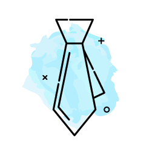
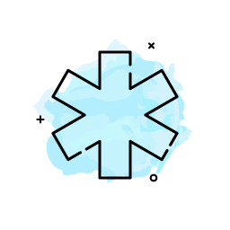
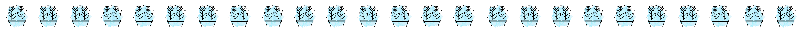

---
---

<link rel="stylesheet" href="styles.css" type="text/css">

$$*I*enjoy*solving*complicated*puzzles*$$

 **I currently work as Data Scientist in a Fintech company - [Rebel](https://rebel.com.br/) - *March/2020 - now* **. I routinely develop Machine Learning projects, analyse customer data and give our B2C team insights on our data-driven business. Luckily, I have an amazing Analytics team with members who work really well alongside each other. Over here I'm able to fulfill my goals of learning and performing projects from beginning to end, adding value to the business.   

.

 **I worked as Data Scientist in a Digital Marketing Agency - [Vitrio](https://www.vitrio.com.br/) - *January/2019 - March/2020* **. My main attributions were maintaining our infrastructure and helping create and automate models that assist and optimise decision making in our Digital Performance teams on a daily basis. I also performed recurrent analysis in order to detect and provide solution for problems our clients have had, trying to inovate as much as I can, of course!

.

 **I used to work Teaching English to brazilian students in a Foreign Languages School - [Yázigi](https://www.yazigi.com.br) *January/2018 - January/2019* **. During my time there I taught kids as young as 5 years old to senior adults. These months were specially gratifying, not only because of my development as a public speaker and contact with many audiences, but also because I was able to focus on personal projects, such as *UFABC DataLab* and *R-Ladies SP*.

I'm specially enthusiastic of diversity in STEM fields. My true passion for Data Science started when I met amazing people in the first *R-Ladies SP* meetup, back in 2018. 

If you would like to contact me, please do so [here](alissamunerato@gmail.com).
